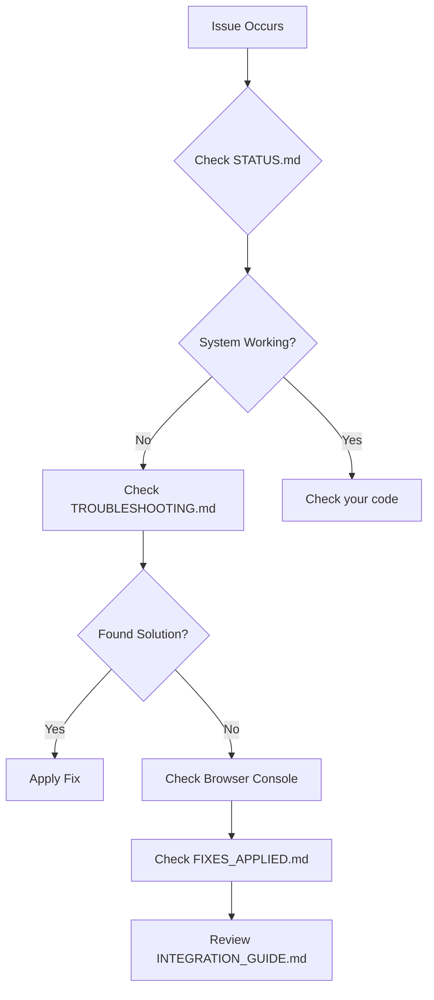

# 📚 SafeRide Dashboard - Documentation Index

Complete guide to all documentation files in this project.

---

## 🚀 Getting Started (Read These First)

### 1. [STATUS.md](./STATUS.md) ⭐ START HERE
**What:** Current system status and quick overview
**When:** First thing to check
**Time:** 2 minutes

### 2. [QUICK_START.md](./QUICK_START.md) ⚡ ESSENTIAL
**What:** Get the dashboard running in under 2 minutes
**When:** When you want to start immediately
**Time:** 2 minutes
```bash
npm install
npm run dev
# Login: admin/admin
```

### 3. [README.md](./README.md) 📖 OVERVIEW
**What:** Complete project overview, features, architecture
**When:** Understanding what the system does
**Time:** 10 minutes

---

## 🔧 Development & Integration

### 4. [INTEGRATION_GUIDE.md](./INTEGRATION_GUIDE.md) 🔌 BACKEND
**What:** How to connect React frontend to Python backend
**When:** Ready to integrate with real backend
**Time:** 15 minutes
**Topics:**
- Architecture overview
- Mock vs. Backend modes
- API service layer
- WebSocket integration
- Deployment guide

### 5. [PYTHON_BACKEND_API.md](./PYTHON_BACKEND_API.md) 🐍 API SPEC
**What:** Complete API specification for Python FastAPI backend
**When:** Implementing the backend
**Time:** 30 minutes
**Topics:**
- All API endpoints with examples
- Request/response formats
- Python code examples
- Database schema
- YOLOv11 integration
- WebSocket protocol

### 6. [python-backend-starter/README.md](./python-backend-starter/README.md) 🎯 BACKEND SETUP
**What:** Python backend quick start guide
**When:** Setting up the Python FastAPI server
**Time:** 5 minutes
```bash
cd python-backend-starter
pip install -r requirements.txt
uvicorn main:app --reload
```

---

## 🎨 Feature Guides

### 7. [PROTECTED_ROUTES_GUIDE.md](./PROTECTED_ROUTES_GUIDE.md) 🔒 AUTHENTICATION
**What:** Complete authentication and route protection system
**When:** Understanding or customizing authentication
**Time:** 10 minutes
**Topics:**
- Role-based access control
- Protected routes implementation
- Auto-logout functionality
- Session management

### 8. [TOAST_NOTIFICATIONS_GUIDE.md](./TOAST_NOTIFICATIONS_GUIDE.md) 📢 NOTIFICATIONS
**What:** Toast notification system for user feedback
**When:** Adding or customizing notifications
**Time:** 8 minutes
**Topics:**
- Notification types and usage
- Custom toast creation
- Real-time alerts
- Best practices

### 9. [IMAGE_VIEWER_GUIDE.md](./IMAGE_VIEWER_GUIDE.md) 🖼️ IMAGE VIEWER
**What:** Advanced image viewing with zoom, pan, and comparison
**When:** Working with violation evidence photos
**Time:** 10 minutes
**Topics:**
- Zoom and pan controls
- Side-by-side comparison
- Download functionality
- Lightbox gallery navigation

---

## 🛠️ Troubleshooting & Fixes

### 10. [TROUBLESHOOTING.md](./TROUBLESHOOTING.md) 🔍 HELP
**What:** Common issues and solutions
**When:** Something isn't working
**Time:** 5 minutes to find your issue
**Topics:**
- WebSocket errors
- Login issues
- API connection problems
- CORS errors
- Performance tips
- Debug checklist

### 11. [FIXES_APPLIED.md](./FIXES_APPLIED.md) ✅ RECENT FIXES
**What:** Recent bug fixes and changes
**When:** Understanding what was fixed
**Time:** 3 minutes
**Current:** WebSocket error fixes

---

## 📋 Configuration

### 12. [.env.example](./.env.example) ⚙️ ENV TEMPLATE
**What:** Environment variable template
**When:** Setting up configuration
**Copy to:** `.env.local`

### 13. [.env.local](./.env.local) 🔧 CURRENT CONFIG
**What:** Your current environment configuration
**Default:** Mock data mode enabled
**Edit:** Change `VITE_USE_MOCK_DATA` to switch modes

---

## 📊 Documentation by Topic

### Frontend Development
1. **Quick Start:** [QUICK_START.md](./QUICK_START.md)
2. **Overview:** [README.md](./README.md)
3. **Status:** [STATUS.md](./STATUS.md)

### Backend Integration
1. **Integration Guide:** [INTEGRATION_GUIDE.md](./INTEGRATION_GUIDE.md)
2. **API Specification:** [PYTHON_BACKEND_API.md](./PYTHON_BACKEND_API.md)
3. **Backend Setup:** [python-backend-starter/README.md](./python-backend-starter/README.md)

### Troubleshooting
1. **Common Issues:** [TROUBLESHOOTING.md](./TROUBLESHOOTING.md)
2. **Recent Fixes:** [FIXES_APPLIED.md](./FIXES_APPLIED.md)
3. **Status Check:** [STATUS.md](./STATUS.md)

### Configuration
1. **Environment Template:** [.env.example](./.env.example)
2. **Current Config:** [.env.local](./.env.local)

---

## 🎓 Learning Path

### Beginner Path
```
1. STATUS.md (2 min) - Check system status
2. QUICK_START.md (2 min) - Get it running
3. README.md (10 min) - Understand the system
4. Play with the dashboard - Explore features
```

### Developer Path
```
1. QUICK_START.md - Get running
2. README.md - Understand architecture
3. INTEGRATION_GUIDE.md - Learn API integration
4. PYTHON_BACKEND_API.md - Study API spec
5. python-backend-starter/README.md - Setup backend
```

### Troubleshooting Path
```
1. TROUBLESHOOTING.md - Find your issue
2. STATUS.md - Check system status
3. FIXES_APPLIED.md - See recent fixes
4. Browser Console (F12) - Check errors
```

---

## 📁 Code Documentation

### Frontend Code Structure
```
/src/app/
├── services/
│   ├── api.ts           # API integration (well documented)
│   ├── mockData.ts      # Mock data examples
│   └── websocket.ts     # WebSocket client
├── types/
│   └── index.ts         # TypeScript definitions
├── pages/
│   ├── Dashboard.tsx    # Main dashboard
│   ├── Login.tsx        # Authentication
│   ├── Incidents.tsx    # Violation list
│   └── ...
└── components/
    └── ...
```

**Each file has inline documentation!**

### Backend Code
```
/python-backend-starter/
├── main.py              # Fully commented FastAPI app
├── requirements.txt     # Dependencies list
└── README.md           # Setup instructions
```

---

## 🔍 Quick Reference

### Environment Variables
```bash
VITE_USE_MOCK_DATA=true          # Use mock data (no backend)
VITE_API_BASE_URL=http://...     # Backend URL
VITE_WS_BASE_URL=ws://...        # WebSocket URL
```

### Default Credentials
```
Username: admin
Password: admin
```

### Common Commands
```bash
npm install              # Install dependencies
npm run dev             # Start dev server
npm run build           # Build for production

cd python-backend-starter
uvicorn main:app --reload  # Start Python backend
```

### Ports
```
Frontend: http://localhost:5173
Backend:  http://localhost:8000
```

---

## 📞 Support Workflow



---

## 🎯 Documentation Checklist

Before asking for help, have you checked:

- [ ] [STATUS.md](./STATUS.md) - System status
- [ ] [QUICK_START.md](./QUICK_START.md) - Basic setup
- [ ] [TROUBLESHOOTING.md](./TROUBLESHOOTING.md) - Your specific issue
- [ ] Browser Console (F12) - Error messages
- [ ] `.env.local` file - Configuration
- [ ] Backend running (if not using mock mode)

---

## 📝 Contributing to Documentation

When adding new features, update:

1. **README.md** - Add to features list
2. **STATUS.md** - Update system status
3. **INTEGRATION_GUIDE.md** - If it affects API
4. **TROUBLESHOOTING.md** - Add common issues
5. **This file** - If you add new docs

---

## 🔗 External Resources

### Technologies Used
- [React Documentation](https://react.dev/)
- [FastAPI Documentation](https://fastapi.tiangolo.com/)
- [Tailwind CSS](https://tailwindcss.com/docs)
- [YOLOv11 Ultralytics](https://docs.ultralytics.com/)
- [TypeScript Handbook](https://www.typescriptlang.org/docs/)

### Libraries
- [Recharts (Charts)](https://recharts.org/)
- [Lucide Icons](https://lucide.dev/)
- [date-fns](https://date-fns.org/)

---

## 📅 Documentation Updates

| Date | File | Change |
|------|------|--------|
| 2024-02-25 | All | Initial documentation created |
| 2024-02-25 | FIXES_APPLIED.md | WebSocket error fixes |
| 2024-02-25 | TROUBLESHOOTING.md | Added WebSocket section |

---

## 💡 Pro Tips

1. **Always start with STATUS.md** - Saves time
2. **Keep .env.local in mock mode** while developing frontend
3. **Read QUICK_START.md first** - Get running immediately
4. **Use TROUBLESHOOTING.md index** - Jump to your issue
5. **Check browser console** - Most issues show there

---

**Last Updated:** 2024-02-25
**Total Documentation Files:** 10+
**Estimated Reading Time (All):** 1-2 hours
**Quick Start Time:** 2 minutes

---

**Happy developing!** 🚀